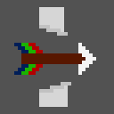
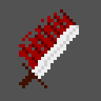
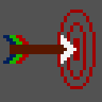

# Damage Types

## Piercing

**Enum:** ```DamageType.piercing```
<br>
**Value:** ```0```

<br>


## Slashing

**Enum:** ```DamageType.slashing```
<br>
**Value:** ```1```

<br>


## Bludgeoning
**Enum:** ```DamageType.bludgeoning```
<br>
**Value:** ```2```

<br>


## Precision 
**Enum:** ```DamageType.precision```
<br>
**Value:** ```3```

<br>


## Fire 
**Enum:** ```DamageType.fire```
<br>
**Value:** ```4```

<br>


## Cold 
**Enum:** ```DamageType.cold```
<br>
**Value:** ```5```

<br>


## Electricity 
**Enum:** ```DamageType.electricity```
<br>
**Value:** ```6```

<br>


## Acid 
**Enum:** ```DamageType.acid```
<br>
**Value:** ```7```

<br>


## Sonic 
**Enum:** ```DamageType.sonic```
<br>
**Value:** ```8```

<br>


## Force 
**Enum:** ```DamageType.force```
<br>
**Value:** ```9```

<br>


