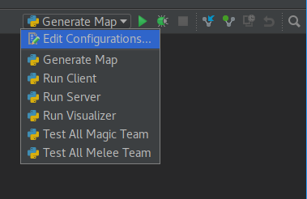
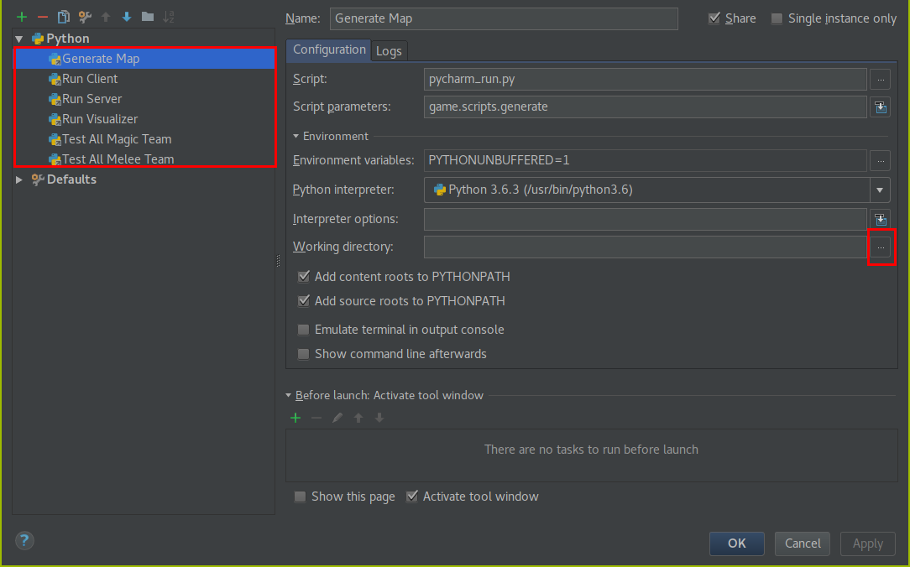

# Installing

***Note: The game has not been tested on MacOS. Linux or Windows are recommended.*** 

## Recommended Install (Windows & Linux)

1. Install [Pycharm Community Edition](https://www.jetbrains.com/pycharm/download/).
2.  Start Pycharm.
<br>

<br>
3. Click "Checkout from version control and then git.
<br>

<br>
4. Now we will clone the github repository. This copys the remote code repository to your local machine.
    1. Fill in fields
        - ***Git Repository URL:*** ```https://github.com/jghibiki/Byt-le-Royale-2017-2018.git```
        - ***Parent Directory:*** Use the ```...``` to select where you would like to download the code to.
        - ***Directory Name:*** ```Byte-le Royale```
    2. Click ```Clone```
<br>

<br>
5. Now we need to set up a virtual environment for PyCharm. A virtual environment is a sandbox for installing python libraries.
    1. Click File -> Settings
    2. In the settings window, click on the triangle next to ```Project: Byte-le ...``` and then click ```Project Interpreter```
    <br>
    
    <br>
    3. Click on the gear icon, then click on ```Create Virtual Env```
    <br>
    
    <br>
    4. In the window that appears, fill in the following fields:
        - ***Name:*** ```.venv```
        - Click ```Ok```
    <br>
    
    <br>
6. Now that we have set up a virtual environment, we need to set the working directory for some helper scripts.
    1. Select ```Edit Configurations``` from the dropdown menu in the upper right corner of the main menu.
    <br>
    
    <br>
    2. In the new window, for each script listed on the left, click on the ```...``` next to the text box for ```Working Directory``` and navigate to the root of the repository, then click apply.
    <br>
    
    <br>

7. To verify that everything is working, select ```Generate Map``` from the dropdown list in the upper right corner of the main window. Then click the green arrow next to the dropdown to run the script. A panel should pop up displaying the output of the script.
<br>

<br>
<br>

<br>


## Windows
***Note: This installation method is not recommended. The PyCharm installation will be much easier to use and provides the benefit of the PyCharm Debugger.***

1. Install Python 3.6: Download Python 3.6 or newer from the [Python Official Website](python.org)

2. Install the [Github Client](https://desktop.github.com/)

3. Using the Github Client clone the game repository 
    - ```https://github.com/jghibiki/Byte-le-Royale-2018.git```

4. Using a Windows Command Prompt, change directory to where you clone the repository. 
    - As a shortcut, browse to the directory using Windows Explorer, and hold shift while right clicking in the folder. This will add an option to the context menu that says "Open Command Propmt Here". Click this button to open a command prompt in this directory.
    
5. In the command prompt type the following to install game requirements.
```shell
pip install -r requirements.txt
```

## Linux
***Note: This installation method is not recommended. The PyCharm installation will be much easier to use and provides the benefit of the PyCharm Debugger.***

1. Install Python 3.6 via your distro's package manager.

2. Clone the repository
```shell
git clone https://github.com/jghibiki/Byte-le-Royale-2018.git
```
3. Change directory into the repository and run
```shell
pip install -r requirements.txt
```
